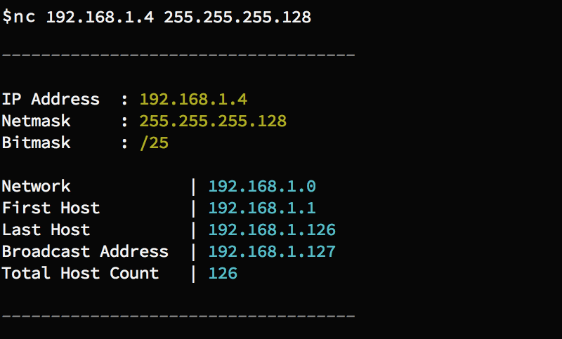

#  Network Calculator [![Build Status][travis-image]][travis-url]

> Network Calculator helps you get information about an IP address



## Install

> [NPM][npm-url]

```sh
$ npm install --save network-calculator
```

## Usage

```js
var nc = require('network-calculator');
console.log(nc('192.168.1.4', '255.255.255.128'));
// >
// {
//   network: '192.168.1.0',
//   bitmask: 25,
//   firsthost: '192.168.1.1',
//   broadcast: '192.168.1.127',
//   lasthost: '192.168.1.126',
//   totalhost: 126
// }

```

## CLI

```
$ npm install -g network-calculator
```

```
$ nc --help

Usage
nc <ip> <netmask>

Example
nc 192.168.1.4 255.255.255.128
```

## License

MIT © [Mert Kahyaoğlu](http://mertkahyaoglu.github.io/)


[npm-url]: https://npmjs.org/package/network-calculator
[travis-url]: https://travis-ci.org/mertkahyaoglu/network-calculator
[travis-image]: https://travis-ci.org/mertkahyaoglu/network-calculator.svg?branch=master
